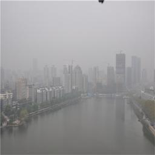
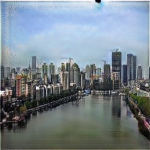

# SCGAN-TensorFlow
An implementation of SCGAN using TensorFlow. You can click here to visit [Torch version](https://github.com/tygrer/SCGAN).

Original paper: https://arxiv.org/abs/2210.07594

## Results on test data


### haze -> clear

| Input | Output |
|-------|--------|
| | | 

## Prerequisites
* TensorFlow 1.0.0
* Python 3.6.0

## Data preparing
First, download the dataset
* Unpaired dataset: The dataset is built by ourselves, and there are all real haze images from website.

    10000 images:
    Address：[Baidu cloud disk](https://pan.baidu.com/s/18Zjm93sZHPHyqgHwlLa-SA)  Extraction code：zvh6

    1000  images:
    Address：[Baidu cloud disk](https://pan.baidu.com/s/1BZ2EZS19nYlYEz5J-2Tt6A)  Extraction code:47v9 

* Paired dataset: The dataset is added haze by ourselves according to the image depth. 
    
    Address: [Baidu cloud disk](https://pan.baidu.com/s/115OUlSkuYkRUOuGMDREkVg) Extraction code : 63xf

    
* Write the dataset to tfrecords

```bash
$ python3 build_data.py
```

Check `$ python3 build_data.py --help` for more details.

## Training

```bash
$ python3 train.py
```

If you want to change some default settings, you can pass those to the command line, such as:

```bash
$ python3 train.py  \
    --X=data/tfrecords/haze.tfrecords \
    --Y=data/tfrecords/dehaze.tfrecords
```

Here is the list of arguments:
```
usage: train.py [-h] [--batch_size BATCH_SIZE] [--image_size IMAGE_SIZE]
                [--use_lsgan [USE_LSGAN]] [--nouse_lsgan]
                [--norm NORM] [--lambda1 LAMBDA1] [--lambda2 LAMBDA2]
                [--learning_rate LEARNING_RATE] [--beta1 BETA1]
                [--pool_size POOL_SIZE] [--ngf NGF] [--X X] [--Y Y]
                [--load_model LOAD_MODEL]

optional arguments:
  -h, --help            show this help message and exit
  --batch_size BATCH_SIZE
                        batch size, default: 1
  --image_size IMAGE_SIZE
                        image size, default: 128
  --use_lsgan [USE_LSGAN]
                        use lsgan (mean squared error) or cross entropy loss,
                        default: True
  --nouse_lsgan
  --norm NORM           [instance, batch] use instance norm or batch norm,
                        default: instance
  --lambda1 LAMBDA1     weight for forward cycle loss (X->Y->X), default: 10.0
  --lambda2 LAMBDA2     weight for backward cycle loss (Y->X->Y), default:
                        10.0
  --learning_rate LEARNING_RATE
                        initial learning rate for Adam, default: 0.0002
  --beta1 BETA1         momentum term of Adam, default: 0.5
  --pool_size POOL_SIZE
                        size of image buffer that stores previously generated
                        images, default: 50
  --ngf NGF             number of gen filters in first conv layer, default: 64
  --X X                 X tfrecords file for training, default:
                        data/tfrecords/apple.tfrecords
  --Y Y                 Y tfrecords file for training, default:
                        data/tfrecords/orange.tfrecords
  --load_model LOAD_MODEL
                        folder of saved model that you wish to continue
                        training (e.g. 20170602-1936), default: None
```

Check TensorBoard to see training progress and generated images.

```
$ tensorboard --logdir checkpoints/${datetime}
```

If you halted the training process and want to continue training, then you can set the `load_model` parameter like this.

```bash
$ python3 train.py  \
    --load_model 20170602-1936
```

## Export model
You can export from a checkpoint to a standalone GraphDef file as follow:

```bash
$ python3 export_graph.py --checkpoint_dir checkpoints/${datetime} \
                          --XtoY_model haze2dehaze.pb \
                          --YtoX_model dehaze2haze.pb \
                          --image_size 256
```


## Inference
After exporting model, you can use it for inference. For example:

```bash
python3 inference.py --model pretrained/haze2dehaze.pb \
                     --input haze.jpg \
                     --output dehaze.jpg \
                     --image_size 256
```


## Contributing
Please open an issue if you have any trouble or found anything incorrect in my code :)


## References

* SCGAN paper: https://arxiv.org/abs/2210.07594
* Official source code in Torch: https://github.com/tygrer/SCGAN
* reference code CycleGan: https://github.com/junyanz/CycleGAN
